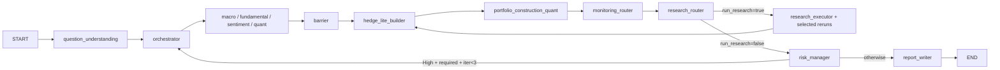

# AI Investment Team (CoFund)

AI-driven investment research pipeline with frontdoor intake, multi-desk analysis, bounded web research, risk gating, monitoring, and replay tooling.

The system analyzes ideas and portfolios. It does not place trades and does not contain broker integration.

## Current Runtime Shape

The repository still centers on 7 primary agents:

- Orchestrator
- Macro
- Fundamental
- Sentiment
- Quant
- Risk Manager
- Report Writer

Around those agents, the runtime now includes several non-desk stages:

- `question_understanding`: frontdoor parser for natural-language intake
- `hedge_lite_builder`: quick hedge candidate screen
- `portfolio_construction_quant`: post-desk portfolio assembly
- `monitoring_router`: event-calendar and quality-trigger escalation
- `research_router` and `research_executor`: bounded evidence loop
- `autonomy_planner`, `bounded_swarm_planner`, `research_round`, `human_handoff`: telemetry-visible auxiliary stages used for recovery, planning, and operator escalation

## Graph Variants

General workflow:



Dedicated position-review workflow:

- Triggered when frontdoor intent is `position_review`
- Uses a smaller graph: `question_understanding -> orchestrator -> 4 desks -> barrier -> risk_manager -> orchestrator/report_writer`
- Skips hedge-lite, portfolio construction, monitoring, and research-loop nodes

## Frontdoor State Contract

The runtime now uses a minimal frontdoor/planner contract:

- `question_type`: intake form for the user's request
  - `single_name_analysis`
  - `single_position_review`
  - `portfolio_rebalance`
  - `hedge_request`
  - `market_outlook`
  - `compare_tickers`
- `intent`: canonical workflow key shared across the graph
  - `single_name`
  - `position_review`
  - `portfolio_rebalance`
  - `hedge_design`
  - `market_outlook`
  - `relative_value`
- `scenario_tags`: planner nuance tags layered on top of the canonical intent
  - examples: `event_risk`, `overheated_check`
- `workflow_kind`: graph selector
  - `general`
  - `position_review`

In practice:

- `state.intent` stays canonical
- planner-specific nuance lives in `state.scenario_tags`
- `question_understanding` drives graph selection and clarification prompts

## Core Rules

- No broker API or order placement code
- Engines own deterministic computation; LLMs interpret and orchestrate
- Every decision is expected to be evidence-backed
- Quant logic remains isolated from direct data fetching
- Risk gates run in fixed order 1 -> 2 -> 3 -> 4 -> 5
- Sentiment tilt is capped to `[0.7, 1.3]`
- Each run is auditable through `run_id`, `events.jsonl`, and `final_state.json`

## Setup

```bash
git clone git@github.com:Coaspe/CoFund.git
cd ai-investment-team

python -m venv .venv
source .venv/bin/activate
pip install -r requirements.txt
cp .env.example .env
```

Add the API keys you want to use to `.env`. Mock mode works without live provider keys.

## Running The Pipeline

Mock mode:

```bash
python investment_team.py --mode mock --seed 42
```

Live mode:

```bash
python investment_team.py --mode live --seed 42
```

Backtest runner:

```bash
./.venv/bin/python backtest/runner.py \
  --start 2024-01-01 --end 2024-06-30 \
  --universe AAPL MSFT --mode mock --seed 42
```

## Control Room And Replay

Run replay dashboard artifacts are written into each run directory:

- `runs/{run_id}/events.jsonl`
- `runs/{run_id}/final_state.json`
- `runs/{run_id}/operator_timeline.log`
- `runs/{run_id}/operator_summary.md`
- `runs/{run_id}/agent_empire.html`

You can also serve the FastAPI control room locally:

```bash
python -m visualization.webapp --host 127.0.0.1 --port 8000
```

The control room supports:

- recent run browsing
- live launch tracking
- launch preparation for position-review clarification
- replay pages for completed runs

## Repository Map

- `investment_team.py`: graph assembly, node wiring, CLI entrypoint
- `agents/`: orchestrator, desk agents, risk, report, and autonomy helpers
- `engines/`: deterministic macro, quant, fundamental, sentiment, and policy logic
- `data_providers/`: market, macro, filing, and web-research providers
- `schemas/`: Pydantic models and shared `InvestmentState`
- `llm/`: provider router, cache, concurrency guard, and fallback behavior
- `risk/`: 5-gate implementation
- `portfolio/`: deterministic portfolio allocator
- `telemetry.py`: run artifact logging
- `visualization/`: replay dashboard renderer and FastAPI control room
- `tests/`: regression, policy, provider, graph, and visualization coverage

## Testing

Run the suite:

```bash
./.venv/bin/python -m pytest -q
```

If you want to inspect the currently collected tests:

```bash
./.venv/bin/python -m pytest --collect-only -q
```

As of 2026-03-09, the repository collects 260 tests. The `tests/` directory contains 31 pytest modules, and `scripts/test_single_agent.py` adds script-level smoke coverage.

Representative test modules:

- `tests/test_regression_state_contract.py`: state contract and workflow regressions
- `tests/test_coverage_expansion.py`: expanded macro/fundamental/sentiment/orchestrator coverage
- `tests/test_llm_test_policy.py`: LLM router and orchestrator fallback policy
- `tests/test_agent_empire_dashboard.py`: replay dashboard rendering
- `tests/test_agent_empire_webapp.py`: FastAPI control-room behavior
- `tests/test_user_handoff.py`: operator escalation when automation cannot recover
