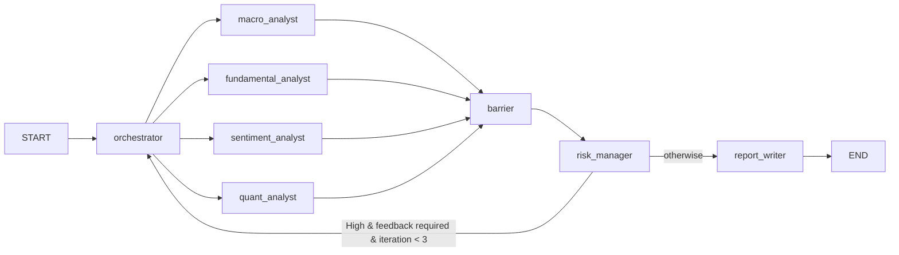
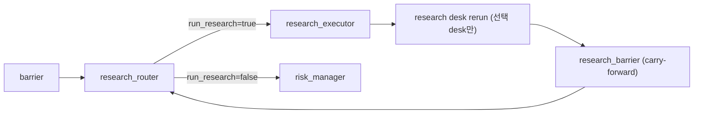

# AI Investment Team 프로젝트 상세 문서 (온보딩/LLM 자문용)

작성 기준일: 2026-02-23  
대상 저장소: `ai-investment-team`  
목적: 처음 보는 사람/다른 LLM이 **프로그램 목적, 동작 방식, 에이전트 판단 기준, 파일 책임**을 빠르게 이해하도록 돕는 기준 문서

---

## 1) 프로젝트 목적과 범위

이 프로젝트는 단일 종목(혹은 오케스트레이터가 제시한 유니버스) 투자 아이디어를 다음 방식으로 검토하는 **멀티 에이전트 의사결정 파이프라인**입니다.

1. 데이터 수집(`data_providers`)  
2. 수치 계산(`engines`)  
3. 에이전트 해석(`agents`)  
4. 리스크 게이트(`agents/risk_agent.py` 또는 `risk/engine.py`)  
5. 최종 보고서 작성(`agents/report_agent.py`)

핵심 목표:
- 정량/정성 분석을 분리하고
- 리스크 게이트를 강제하며
- 실행 로그(`runs/{run_id}`)를 남기는 것

명시적 비목표:
- 실제 주문 실행(브로커 API) 없음

---

## 2) 실행 진입점과 전체 제어 흐름

메인 진입점:
- `investment_team.py`

실행 예:
- `python investment_team.py --mode mock --seed 42`
- `python investment_team.py --mode live --seed 42`

실행 그래프(LangGraph):

리서치 확장 경로(정책 트리거 기반):

핵심 루프 조건:
- `risk_assessment.grade == "High"` 이고
- `orchestrator_feedback.required == True` 이고
- `iteration_count < 3` 일 때만 오케스트레이터로 재진입

실제 관찰된 기본 패턴(mock):
1. 초기 위임
2. 리스크 반려 시 scale/hedge
3. 재반려 시 pivot
4. 반복 한도 도달 후 보고서로 종료

---

## 3) 상태 모델 (`schemas/common.py`)

공유 상태 타입:
- `InvestmentState` (TypedDict)

중요 필드:
- `run_id`, `as_of`, `mode`
- `target_ticker`, `analysis_tasks`, `iteration_count`
- `macro_analysis`, `fundamental_analysis`, `sentiment_analysis`, `technical_analysis`
- `risk_assessment`, `final_report`
- `completed_tasks` (dict merge reducer)
- `trace`, `errors` (list append reducer)
- `research_round`, `max_research_rounds`
- `evidence_requests`(append+dedupe), `evidence_store`, `evidence_score`
- `last_research_delta`, `research_stop_reason`

유틸리티:
- `create_initial_state()`
- `make_evidence()`, `make_risk_flag()`
- `first_not_none()`, `compute_signed_weight()`, `compute_disagreement_score()`

중요 포인트:
- `completed_tasks`는 병렬 노드 fan-in 시 병합됨
- `barrier_node`가 실행 누락 데스크를 `status="skipped"`로 표준화함
- `research_router_node`만 `plan_additional_research(...)`를 호출하며, research loop는 `iteration_count`를 증가시키지 않음
- `last_research_delta`는 `research_executor` 1회 종료 시점에만 갱신됨(신규 unique hash 개수)

### 3.1 Research Policy 고정 규칙

- `evidence_score = coverage(0~40) + freshness(0~25) + source_trust(0~25) - contradiction_penalty(0~15)`
- coverage: `earnings/macro/ownership/valuation` 버킷 충족당 +10
- freshness: 증거 age-day 기반 점수 평균
- source trust: 도메인 tier 평균(`official 1.0 / wire 0.8 / news 0.6 / other 0.4`)을 25점으로 스케일
- contradiction penalty: 동일 `(ticker,kind)` 그룹 내 상반 신호 공존 시 그룹당 5점, 최대 15점
- 조기 종료:
  - `evidence_score >= 75`
  - `last_research_delta < 2`
  - `research_round >= max_research_rounds`
  - query budget 초과

### 3.2 Resolver 우선순위

- `ownership_identity`: `SECEdgarProvider(Form4/13F/13D/13G)` 우선, 실패 시 web fallback
- `press_release_or_ir`: SEC 8-K 우선 → IR domain → NewsAPI
- `macro_headline_context`: 공식 기관 릴리즈 우선 → NewsAPI 보조

### 3.3 Web Fetch 보안 정책

- HTTPS only
- redirect 최종 도메인 allowlist 재검사
- private/loopback/link-local/reserved IP 차단
- timeout/size limit 강제
- allowlist 밖 fetch 금지
- fetch 대상: NewsAPI allowlist 통과 URL 또는 구조화 provider의 공식 URL만 허용

### 3.4 Autonomy Upgrade v1.1 (Explicit ReAct)

핵심 철학:
- 엔진(`engines/*`)은 계산만 담당
- LLM overlay는 해석/질문 생성/추가 리서치 계획만 담당

추가된 자율성 구성:
- `orchestrator_directives.desk_tasks`의 `horizon_days/focus_areas`를 desk 실행 시 실제 반영
- desk 출력에 `open_questions / decision_sensitivity / followups` 표준 필드 추가
- desk가 `evidence_store`를 읽어 `evidence_digest` 생성 및 서사(`key_drivers`, `what_to_watch`) 갱신
- `research_router`가 requests가 빈약하면 baseline seed(earnings/macro/ownership/valuation)를 자동 삽입
- desk의 `open_questions`를 `evidence_requests`로 변환해 research loop로 이관

Explicit ReAct phase 적용 방식(출력은 구조화 필드만):
1. THOUGHT: 내부 gap scan (출력 직접 노출 금지)
2. ACTION: `open_questions`, `evidence_requests`, `followups` 생성
3. OBSERVATION: `evidence_digest` 기반 narrative 갱신
4. REFLECTION: `decision_sensitivity` 갱신, 조건부 결론 강도 명시

안전/호환성:
- LLM 실패/미설정 시 deterministic fallback 유지
- LLM overlay 출력은 JSON patch only, 허용 필드만 반영
- 기존 출력 키는 유지하고 새 키만 추가
- Sentiment `tilt_factor`는 overlay 이후에도 `[0.7, 1.3]` 재검증

---

## 4) 에이전트별 동작 방식 (가장 중요)

## 4.1 Orchestrator (`agents/orchestrator_agent.py`)

역할:
- 사용자 요청을 해석해 4개 데스크 태스크를 발행
- 리스크 피드백을 받아 전략 수정

판단 모드:
1. `iteration == 0`: `initial_delegation`
2. `iteration >= 1`: `scale_down` 또는 `add_hedge` 또는 `pivot_strategy`
3. `iteration >= 3`: `fallback_abort`

의사결정 기준:
- 구조적 반려 사유(`structural_risk`, `going_concern`, `accounting_fraud`)가 있으면 pivot 우선
- 집중도 사유면 hedge 쪽으로 기울고, 그 외는 scale_down
- 2회차 재시도는 pivot 강제

인텐트 규칙 분류(`classify_intent_rules`):
- `single_ticker_entry`
- `overheated_check`
- `compare_tickers`
- `market_outlook`
- `event_risk`

LLM 전략:
- LLM 우선 시도 + 규칙 fallback
- `plan_cache`와 `llm_router` 캐시 사용
- LLM 실패/검증실패 시 항상 규칙 기반 플랜으로 복귀

출력 핵심:
- `target_ticker`
- `iteration_count + 1`
- `orchestrator_directives`(action_type, investment_brief, desk_tasks)

---

## 4.2 Macro Analyst (`agents/macro_agent.py` + `engines/macro_engine.py`)

역할:
- 매크로 지표를 레짐/리스크온오프로 변환

주요 계산:
- `compute_macro_features()`: curve/credit/inflation/growth/policy 버킷
- `compute_macro_axes()`: growth/inflation/rates/credit/liquidity 5축 점수(-3~+3)
- `compute_risk_on_off()`: 가중 합으로 risk_score(-100~100), risk_on/off 판정
- `compute_overlay_guidance()`: 레짐별 오버레이 제안

핵심 임계값 예시:
- HY OAS > 600 => credit crisis
- curve inverted + growth below trend => contraction
- risk_score >= 30 => risk_on, <= -20 => risk_off

최종 판단:
- `risk_on_off`, tail risk 여부, inflation/rates 조합으로
  - `primary_decision` (bullish/neutral/bearish)
  - `recommendation` (allow/allow_with_limits/reject) 결정

출력 강화:
- `key_drivers`, `what_to_watch`, `scenario_notes` 생성

---

## 4.3 Fundamental Analyst (`agents/fundamental_agent.py` + `engines/fundamental_engine.py`)

역할:
- 재무 건전성/구조 리스크/밸류 스트레치 평가

핵심 계산:
- `compute_structural_risk()`
  - Hard flag: `going_concern`, `material_weakness`, `restatement`, `regulatory_action`, `default_risk`
  - Hard flag 하나라도 있으면 `structural_risk_flag=True`
- `compute_factor_scores()`
  - value/quality/growth/leverage/cashflow (0~1)
- `compute_valuation_stretch()`
  - history/peer 우선
  - 없으면 absolute 임계치 fallback

중요 판단 규칙:
- `structural_risk_flag=True` => `recommendation="reject"`, `primary_decision="avoid"`
- stretch 높고 성장 약하면 bearish + 제한
- 성장 특례(`revenue_growth>20` & stretch medium)면 neutral + 제한

리스크팀 연계:
- `hard_red_flags`, `soft_flags`, `notes_for_risk_manager`를 명시적으로 전달

---

## 4.4 Sentiment Analyst (`agents/sentiment_agent.py` + `engines/sentiment_engine.py`)

역할:
- 뉴스/포지셔닝/변동성 정보를 **전술적 틸트**로 변환

핵심 원칙:
- R5: sentiment는 단독 방향성 의사결정 금지
- 틸트 하드캡: `[0.7, 1.3]`
- 추천은 항상 `allow_with_limits` 중심

주요 계산:
- `compute_sentiment_features()`: pcr, vix, skew, crowding, base_tilt
- `dedupe_and_weight_news()`: 제목 중복 제거 + 시간감쇠 + `news_volume_z`
- `compute_sentiment_velocity()`: 3d/7d 속도와 급반전 감지
- `detect_catalyst_risk()`: 이벤트 타입/위험도
- `infer_vol_regime()`: quant > macro > vix > fallback 우선순위

틸트 보정:
1. base tilt 계산
2. catalyst high면 tilt=1.0으로 중립화
3. vol crisis면 tilt 최대 0.9
4. 최종 hardcap [0.7, 1.3]

---

## 4.5 Quant Analyst

현재 런타임 경로:
- `investment_team.py`의 `quant_analyst_node`가
  - `DataHub`로 가격 시계열 획득
  - `engines/quant_engine.py`의 `generate_quant_payload()`
  - `mock_quant_decision()`으로 결정

`engines/quant_engine.py` 결정 로직(4단계):
1. 고변동 상태확률(`regime_2_high_vol`)로 방어모드 여부
2. 통계 유의성(ADF, Newey-West)
3. Z-score 타이밍
   - `> +2`: SHORT
   - `< -2`: LONG
   - `|z| < 0.5`: CLEAR
   - 그 외 HOLD
4. Kelly * fractional + CVaR 한도 적용

참고:
- `agents/quant_agent.py`는 독립 실행/실험용 확장판이며,
  메인 파이프라인은 `engines/quant_engine.py` 경로를 사용

---

## 4.6 Risk Manager (`agents/risk_agent.py`)

역할:
- 4개 데스크 출력을 받아 리스크 한도 관점에서 재판정

핵심 흐름:
1. 포트폴리오 리스크 요약 계산(`calculate_portfolio_risk_summary`)
2. payload 조립(`aggregate_risk_payload`)
3. 결정 엔진(`compute_risk_decision`) 실행
4. 선택적으로 LLM이 **서술만 보강** (수치/결정 변경 금지)

`compute_risk_decision` 게이트 순서:
1. Gate1 하드한도(CVaR, leverage)
2. Gate2 집중도(HHI, 섹터, component VaR)
3. Gate3 구조 리스크(fundamental hard flags)
4. Gate4 레짐 정합성(risk-off에서 공격적 LONG 감축)
5. Gate5 모델 이상(quant 비중 이상치)

추가 하드닝:
- R6 불일치 점수(`compute_disagreement_score`) > 0.5면 자동 감축 + 피드백
- 증거 부족(`evidence` 없음/`data_ok=False`) 시 보수 플래그
- SHORT는 Gate4에서 헤지로 인정해 불필요 감축 방지

출력:
- `per_ticker_decisions`
- `portfolio_actions`
- `orchestrator_feedback`
- `grade` (feedback required면 High)

---

## 4.7 Report Writer (`agents/report_agent.py`)

역할:
- 최종 IC Memo 마크다운 생성

시나리오:
- APPROVE: 알파 논리, 사이징 근거 강조
- REJECT/FALLBACK: 거래하지 않는 이유와 재검토 조건 강조

동작:
- LLM 사용 가능 시 프롬프트 기반 생성
- 불가 시 규칙 기반 `_mock_generate_report()` 생성

특징:
- 리스크 플래그, 헷지, gross/net 조정, 재검토 트리거까지 포함

---

## 5) 에이전트 상호작용의 실제 메커니즘

1. 오케스트레이터가 iteration을 증가시키며 라운드를 시작
2. 데스크 4개가 병렬 실행
3. barrier가 누락/구버전 출력을 `skipped/stale`로 표준화
4. 리스크 매니저가 단일 진입점으로 평가
5. 리스크 피드백이 있으면 오케스트레이터 재호출
6. 최대 반복에 도달하면 리포트 작성 후 종료

중요 동기화 장치:
- `barrier_node`: fan-in 안정화
- `risk_manager_node`의 `_iteration_evaluated`: 같은 iteration 중복 평가 방지

---

## 6) 데이터 계층 (`data_providers/*`)

중앙 허브:
- `data_providers/data_hub.py`

모드 분기:
- `mock`: 레거시 mock 함수(`fred_provider`/`market_data_provider`) 사용
- `live`: FRED/FMP/SEC/NewsAPI/AlphaVantage/TwelveData 실제 프로바이더 사용

프로바이더 특징:
- `BaseProvider`: HTTP 세션 + retry + rate limit + sqlite cache
- `FREDProvider`: 매크로 스냅샷
- `FMPProvider`: 재무/비율
- `SECEdgarProvider`: 공시 키워드 플래그
- `NewsAPIProvider`, `AlphaVantageProvider`: 뉴스 감성
- `TwelveDataProvider`: 가격시계열(실패 시 yfinance fallback, 최후 mock)

---

## 7) 리스크 모듈 이중 구조 정리

현재 저장소에는 리스크 로직이 2계층으로 존재합니다.

1. **실행 경로(메인 파이프라인에서 사용)**  
   - `agents/risk_agent.py`의 `risk_manager_node` + `compute_risk_decision`

2. **모듈형 게이트 엔진(테스트/리팩터링 경로)**  
   - `risk/engine.py` + `risk/gates/gate1~5.py`

현재 `investment_team.py`는 1번 경로를 호출합니다.
`risk/engine.py`는 주로 `tests/test_gate_parity.py`, `tests/test_pipeline_reproducibility.py`에서 검증됩니다.

---

## 8) 감사/저장 계층

실행 감사:
- `telemetry.py`
  - `runs/{run_id}/meta.json`
  - `runs/{run_id}/events.jsonl`
  - `runs/{run_id}/final_state.json`

PIT 저장 유틸:
- `storage/pit_store.py`
  - raw/features/decisions/llm_io/final_report/config 구조 지원
  - 현재 메인 파이프라인에서 전면 사용되지는 않음
  - 백테스트에서 일부(`save_gate_trace`, `save_positions`, `save_config_snapshot`) 사용

---

## 9) 백테스트 (`backtest/runner.py`)

특징:
- 현재는 실제 그래프 호출형 백테스트가 아니라
  **결정론적 mock 포지션 생성 + 비용 반영 PnL 계산** 중심
- 결과 저장:
  - `runs/backtest_{id}/backtest_results.csv`
  - `runs/backtest_{id}/backtest_summary.json`
  - `runs/backtest_{id}/config/config_hash.txt`

---

## 10) 파일별 역할 맵

## 10.1 루트/핵심

| 파일 | 역할 | 런타임 사용 |
|---|---|---|
| `investment_team.py` | LangGraph 메인 파이프라인, 노드 조립/실행 | 핵심 |
| `telemetry.py` | 실행 이벤트/최종 상태 로깅 | 핵심 |
| `README.md` | 개요/실행 가이드 | 문서 |
| `.env.example` | API 키/튜닝 변수 예시 | 설정 |
| `requirements.txt` | 의존성 목록 | 설정 |

## 10.2 에이전트

| 파일 | 역할 | 비고 |
|---|---|---|
| `agents/orchestrator_agent.py` | CIO 플래닝, 피드백 대응, fallback | 메인 경로 |
| `agents/macro_agent.py` | 매크로 레짐/리스크온오프 해석 | 메인 경로 |
| `agents/fundamental_agent.py` | 구조리스크/밸류/팩터 해석 | 메인 경로 |
| `agents/sentiment_agent.py` | 감성 틸트/이벤트 리스크 해석 | 메인 경로 |
| `agents/risk_agent.py` | 리스크 의사결정 게이트(실행 경로) | 메인 경로 |
| `agents/report_agent.py` | 최종 IC Memo 생성 | 메인 경로 |
| `agents/quant_agent.py` | 확장형 독립 퀀트 에이전트 | 보조/실험 |

## 10.3 엔진

| 파일 | 역할 |
|---|---|
| `engines/macro_engine.py` | 5축 매크로 점수/레짐 계산 |
| `engines/fundamental_engine.py` | Altman/coverage/FCF/valuation 계산 |
| `engines/sentiment_engine.py` | 감성/뉴스 dedupe/vol regime 계산 |
| `engines/quant_engine.py` | 순수 정량 계산 + 규칙 결정 |

## 10.4 데이터/LLM/스키마

| 파일 | 역할 |
|---|---|
| `data_providers/data_hub.py` | 에이전트 공통 데이터 진입점 |
| `data_providers/base.py` | 공통 HTTP/cache/rate-limit 기반 |
| `data_providers/cache.py` | sqlite 캐시 |
| `data_providers/rate_limiter.py` | QPS 제한 |
| `data_providers/fred_provider.py` | 매크로/FRED + 레거시 mock 래퍼 |
| `data_providers/fmp_provider.py` | 재무/FMP |
| `data_providers/sec_edgar_provider.py` | SEC 공시 플래그 |
| `data_providers/newsapi_provider.py` | 뉴스 감성(룰기반 점수) |
| `data_providers/alphavantage_provider.py` | AV 뉴스 감성(옵션) |
| `data_providers/twelvedata_provider.py` | 시계열 가격 |
| `data_providers/market_data_provider.py` | 레거시 가격 fetch(mock/live) |
| `llm/router.py` | 에이전트별 모델 라우팅/캐시/fallback |
| `schemas/common.py` | Evidence/State/공통 모델 |
| `schemas/taxonomy.py` | 매크로 레짐 canonical 매핑 |
| `config/settings.py` | 환경변수 기반 설정 로더 |

## 10.5 리스크/포트폴리오/스토리지/검증

| 파일 | 역할 | 사용 현황 |
|---|---|---|
| `risk/engine.py` | 모듈형 5게이트 실행기 | 테스트 중심 |
| `risk/gates/gate1_hard_limits.py` | Gate1 구현 | 테스트 중심 |
| `risk/gates/gate2_concentration.py` | Gate2 구현 | 테스트 중심 |
| `risk/gates/gate3_structural.py` | Gate3 구현 | 테스트 중심 |
| `risk/gates/gate4_regime_fit.py` | Gate4 구현 | 테스트 중심 |
| `risk/gates/gate5_model_anomaly.py` | Gate5 구현 | 테스트 중심 |
| `portfolio/allocator.py` | 멀티티커 제안 비중 생성기 | 현재 미연결 |
| `storage/pit_store.py` | PIT 저장 유틸 | 일부(백테스트) |
| `validators/factcheck.py` | 출력 사실성 검증 규칙 | 테스트 중심(런타임 미연결) |

## 10.6 스크립트/평가

| 파일 | 역할 |
|---|---|
| `scripts/smoke_test_llm.py` | LLM 라우터 스모크 테스트 |
| `scripts/test_single_agent.py` | 개별 에이전트 단독 테스트(일부 시그니처 구버전 가능성) |
| `eval/smoke_run.py` | 파이프라인 다회 실행 스모크 |
| `backtest/runner.py` | 결정론적 PIT 백테스트 |

## 10.7 테스트 파일 역할

| 파일 | 검증 포인트 |
|---|---|
| `tests/test_graph_end_to_end.py` | E2E 완료, evidence 존재, events 생성, R0 |
| `tests/test_graph_finishes.py` | 그래프 종료 보장 |
| `tests/test_risk_barrier.py` | iteration당 risk_manager 중복 실행 방지 |
| `tests/test_risk_hardening.py` | 하드닝 항목(0.0/short/taxonomy/disagreement 등) |
| `tests/test_sentiment_tilt_cap.py` | R5 틸트 범위/센티먼트 제한 |
| `tests/test_structural_risk_gate3.py` | 구조 리스크 reject |
| `tests/test_report_factcheck.py` | factcheck 규칙 검증 |
| `tests/test_quant_engine_purity.py` | quant engine 순수성(R3) |
| `tests/test_provider_smoke.py` | 프로바이더 키 유무 스모크 |
| `tests/test_gate_parity.py` | `agents/risk_agent` vs `risk/engine` 결정 패리티 |
| `tests/test_pipeline_reproducibility.py` | 동일 PIT 입력 재현성 |
| `tests/test_coverage_expansion.py` | 확장 커버리지(axes/stretch/dedupe/intent 등) |
| `tests/test_gate_order.py` | 게이트 순서 점검(현 구현 경로와 일부 불일치 가능) |

---

## 11) 온보딩 시 반드시 알아야 할 운영 포인트

1. 메인 런타임 리스크는 `agents/risk_agent.py` 경로다.  
2. `risk/engine.py`는 리팩터링/테스트용 병행 구현이다.  
3. `portfolio/allocator.py`는 현재 메인 그래프에 연결되어 있지 않다.  
4. `validators/factcheck.py` 규칙은 테스트로 검증되지만 메인 실행에 직접 연결되지 않았다.  
5. `scripts/test_single_agent.py`는 일부 함수 시그니처가 최신 코드와 맞지 않을 수 있다.  
6. `tests/test_gate_order.py`는 루트 `risk_agent.py`를 참조해 실효성이 제한될 수 있다.  
7. `investment_team.py`에서 CLI `--seed`는 출력에 표시되지만 `create_initial_state(..., seed=...)`로 전달되지 않아, mock 데이터는 사실상 `run_id` 기반 시드 경로를 탄다(동일 seed라도 run마다 결과가 달라질 수 있음).  

---

## 12) 다른 LLM에게 자문 요청할 때 권장 컨텍스트

아래 파일을 함께 제공하면 정확도가 높다.

1. `investment_team.py`
2. `agents/orchestrator_agent.py`
3. `agents/risk_agent.py`
4. `engines/macro_engine.py`
5. `engines/fundamental_engine.py`
6. `engines/sentiment_engine.py`
7. `engines/quant_engine.py`
8. `schemas/common.py`
9. `llm/router.py`
10. 필요한 경우 `tests/test_risk_hardening.py`, `tests/test_gate_parity.py`

권장 질문 형식:
- “현재 리스크 피드백 루프가 반복되는 근본 원인을 코드 기준으로 설명해줘”
- “Gate2가 orchestrator feedback을 덜 발생시키는 것이 의도인지 검토해줘”
- “`risk/engine.py`를 메인 런타임에 연결할 때 회귀 위험을 분석해줘”

---

## 13) 빠른 로컬 점검 체크리스트

1. 실행: `python investment_team.py --mode mock --seed 42`
2. 산출물 확인:
   - `runs/{run_id}/meta.json`
   - `runs/{run_id}/events.jsonl`
   - `runs/{run_id}/final_state.json`
3. 테스트:
   - `pytest tests/test_graph_end_to_end.py -q`
   - `pytest tests/test_risk_hardening.py -q`
   - `pytest tests/test_gate_parity.py -q`

---

## 14) 요약

이 프로젝트의 본질은 다음 3가지입니다.

1. **엔진(수치)과 에이전트(해석) 분리**
2. **리스크 게이트 우선**
3. **감사 가능한 실행 로그**

특히 실무적으로 중요한 부분은, 오케스트레이터-리스크매니저 피드백 루프가 전략을 단계적으로 축소/피벗/중단시키는 구조이며, 이 판단 근거가 `evidence`와 `events.jsonl`로 추적 가능하다는 점입니다.

---

## 15) Autonomy Runtime Self-Heal (v1.1+)

런타임 중 발생하는 기술 이슈와 인사이트 공백을 사용자 추가 질의 없이 자동으로 보강하도록 다음 흐름을 사용한다.

1. `research_router_node`에서 데스크 출력(`limitations`, `needs_more_data`, `open_questions`, `data_quality`)을 수집한다.
2. `agents/autonomy_planner.py::plan_runtime_recovery`가 이슈를 구조화하고:
   - `actions`(예: `provider_fallback`, `run_research`, `rerun_desk`, `adjust_risk`)
   - `evidence_requests`(공식/공시 우선 경로)
   를 생성한다.
3. 생성된 요청은 기존 리서치 정책/예산(`max_web_queries_per_run`, `max_web_queries_per_ticker`) 안에서 자동 실행된다.
4. 실행 결과는 `evidence_store`에 적재되고 필요한 desk만 rerun되어 인사이트가 갱신된다.
5. `events.jsonl`에 `autonomy_planner`, `research_round` 이벤트가 남아 자율 보강 과정을 감사 가능하게 유지한다.
6. 자동 해결 불가로 판단되면 `user_action_required=true`와 `user_action_items[]`를 상태에 기록하고, `human_handoff` 이벤트를 남긴다.

추가로 Risk LLM 서사 보강 단계는 413/TPM 초과 시 compact payload로 자동 재시도하며, 상태를 `risk_decision._llm_enrichment_status`에 기록한다.
