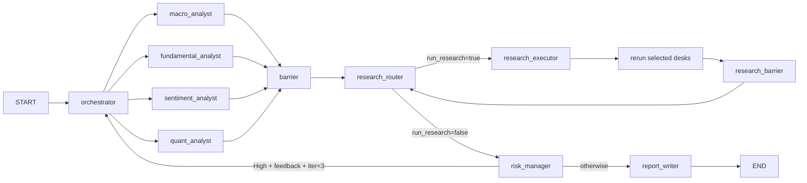

# AI Investment Team 프로젝트 상세 문서 (비개발자 친화판)

작성 기준일: 2026-02-25  
대상 저장소: `ai-investment-team`  
문서 목적: 코드를 모르는 사람도 "이 시스템이 왜, 언제, 어떤 기준으로 움직이는지" 이해할 수 있도록 설명한다.

---

## 0) 이 문서 읽는 법

이 문서는 모든 섹션을 같은 방식으로 설명한다.

- `기술 설명`: 코드/변수 기준으로 정확하게 설명
- `쉽게 말해`: 비개발자 관점으로 번역
- `실무 예시`: 실제 로그나 운영에서 어떻게 보이는지

핵심 원칙:
- 이 시스템은 **분석/판단** 시스템이다.
- 실제 주문을 내리는 코드(브로커 API)는 없다.

---

## 1) 5분 요약

이 프로젝트는 "한 명의 PM(Orchestrator) + 4개 분석 데스크 + 리스크 위원회" 구조로 돌아가는 자동 투자 검토 파이프라인이다.

- Orchestrator: 이번 라운드에 누가 무엇을 볼지 지시
- Macro/Fundamental/Sentiment/Quant: 각자 전문 관점으로 분석
- Research Router/Executor: 근거가 부족하면 자동으로 추가 조사
- Risk Manager: 5개 게이트로 최종 리스크 심사
- Report Writer: 투자심의 메모 작성

쉽게 말해:
- 사람으로 치면 "팀장 -> 실무자 보고 -> 심사위원회 -> 최종 보고서" 흐름이다.
- 데이터가 약하면 자동으로 "자료 더 찾아와"를 수행한다.

---

## 2) 전체 흐름

### 2.1 메인 실행 경로

실행 진입점:
- `investment_team.py`

실행 예:
- `python investment_team.py --mode mock --seed 42`
- `python investment_team.py --mode live --seed 42`

기술 설명:
- 최대 오케스트레이터 반복: `MAX_ITERATIONS = 3`
- 리서치 라운드 기본 상한: `max_research_rounds = 2`

쉽게 말해:
- 한 번에 결론 안 나면 최대 3번까지 전략을 수정해본다.
- 근거 수집도 무한 반복하지 않고 기본 2라운드에서 끊는다.

실무 예시:
1. 초기 위임(initial delegation)
2. 리스크 반려 -> scale down / hedge / pivot
3. 필요 시 추가 조사
4. 반복 한도 도달 혹은 승인 시 최종 보고서

---

## 3) 핵심 용어 사전 (비개발자 버전)

아래는 로그/상태 파일에서 자주 보이는 필드를 실제 의미로 풀어쓴 표다.

| 기술 용어 | 실제 의미 | 왜 중요한가 |
|---|---|---|
| `open_questions` | 현재 결론을 바꿀 수 있는 "미해결 핵심 질문" 목록 | 다음 조사 우선순위를 정함 |
| `evidence_requests` | open question을 풀기 위해 실제로 보낼 조사 요청 목록 | 리서치 실행 입력값 |
| `evidence_digest` | 이미 모인 근거를 desk가 읽기 쉬운 요약으로 정리한 것 | rerun 시 출력이 실제로 바뀌게 하는 재료 |
| `decision_sensitivity` | 어떤 조건이 바뀌면 현재 결론이 바뀌는지 | 결론의 취약점/민감도 파악 |
| `followups` | 다음 라운드에서 할 후속 액션 제안 | 자동 self-heal 실행 후보 |
| `needs_more_data` | 지금 데이터로는 확신하기 어렵다는 신호 | 리서치 트리거 강화 |
| `primary_decision` | 방향성 결론(예: bullish/neutral/bearish) | 의사결정의 중심 축 |
| `recommendation` | 실행 권고 강도(allow/allow_with_limits/reject) | 리스크 승인과 직접 연결 |
| `tilt_factor` | 감성 데스크가 제안하는 전술적 가감 계수 | 포지션 강도 조절 |
| `research_need_score` | "추가 조사가 얼마나 필요한지" 점수 | 리서치 실행 여부 핵심 기준 |
| `impact_score` | 빠진 정보가 결과에 미칠 영향도 | 중요 정보 누락 감지 |
| `uncertainty_score` | 현재 결론의 불확실성 정도 | 애매한 상황 감지 |
| `last_research_delta` | 직전 리서치로 새로 얻은 근거 개수 | 더 조사할 가치가 남았는지 판단 |
| `_executed_requests` | 이번 리서치에서 실제 실행된 요청 감사 로그 | 무엇을 실제로 했는지 추적 |
| `_rerun_plan` | 어떤 desk를 왜 rerun할지 계획 | rerun 선택의 근거 추적 |
| `_swarm_candidates` | 조사 후보군(원본+보강 포함) | planner 입력의 감사 흔적 |
| `_swarm_plan` | planner가 정리한 최종 후보 계획 | allowlist/budget 적용 전후 분석 |

---

## 4) 상태 모델(InvestmentState) 쉽게 이해하기

### 4.1 상태를 한 문장으로

`InvestmentState`는 "현재 회의가 어디까지 진행됐고, 누가 어떤 근거로 어떤 판단을 했는지"를 담는 단일 공유 보드다.

### 4.2 자주 보는 상태 필드

- `run_id`, `as_of`, `mode`: 이번 실행의 신분증
- `macro_analysis/fundamental_analysis/...`: 데스크별 결과 본문
- `evidence_store`: 모인 근거 원문 저장소
- `evidence_score`: 근거 품질 종합 점수
- `research_round`: 추가 조사 몇 라운드째인지
- `completed_tasks`: 이번 라운드에서 끝난 desk
- `trace/events`: 왜 이런 경로를 탔는지 감사 정보

### 4.3 seed 동작

기술 설명:
- CLI `--seed`는 `create_initial_state(..., seed=...)`로 전달된다.
- 현재 `_make_seed`는 `state.get("seed")`를 우선 참조한다.
- top-level `seed`가 없으면 `run_id` 해시 기반 시드를 사용한다.

쉽게 말해:
- 같은 seed를 줘도 상태에 seed가 어떻게 들어오느냐에 따라 재현성이 달라질 수 있다.

---

## 5) Research Loop(자동 추가 조사) 상세

## 5.1 왜 리서치 루프가 필요한가

초기 분석만으로는 근거가 비거나(coverage 부족), desk끼리 결론이 충돌할 수 있다. 이때 자동으로 근거를 더 모아 결론 신뢰도를 올린다.

## 5.2 research_router가 하는 일

입력 소스(우선순위):
1. 기존 `raw_requests`(desk가 직접 낸 요청)
2. `open_questions`를 요청 형태로 변환한 것
3. coverage 버킷 결손(또는 후보가 비었을 때) baseline seed
4. 런타임 복구 플래너(recovery)가 추가한 요청
5. desk 간 결론 충돌(disagreement) 보정 요청

버킷(coverage):
- earnings (실적/가이던스/IR 발표 근거)
- macro (금리·물가·성장 같은 거시 근거)
- ownership (누가 얼마나 샀는지/팔았는지 보유자 근거)
- valuation (현재 가격이 비싼지 싼지 평가 근거)

기술 설명:
- planner 후보는 dedupe 후 안정 정렬(stable + deterministic tie-breaker)
- 후보가 하나라도 있으면 planner(`plan_additional_research`)를 호출
- 호출 결과가 `None`이면 후보 그대로 사용

쉽게 말해:
- "처음부터 요청이 하나도 없어도" 시스템이 스스로 조사 계획을 만든다.
- 필요하면 "복구용 요청"과 "의견충돌 해소 요청"도 자동으로 섞어서 후보를 만든다.

용어 짧은 해설:
- `raw_requests`: 각 desk가 \"추가로 찾아달라\"고 제출한 원본 요청
- `plan_additional_research`: 후보 요청을 우선순위/예산 기준으로 정리하는 planner 단계
- `dedupe`: 같은 요청을 중복 실행하지 않도록 하나만 남기는 정리

## 5.3 리서치 실행 트리거 기준

`should_run_web_research(...)`는 아래 중 하나라도 참이면 조사 실행 후보로 본다.

- `research_need_score >= 4`
- `disagreement_score > 0.5`
- 고영향 결손 필드 존재
- 사용자가 직접 조사성 질문을 함

여기서:
- `research_need_score = impact_score + uncertainty_score`

쉽게 말해:
- "영향이 큰데 불확실하다" 또는 "팀 의견이 많이 갈린다"면 자동으로 근거 수집을 더 한다.

점수 용어 해설:
- `impact_score`: \"이 정보가 빠지면 결론이 얼마나 크게 흔들리는가\" 점수
- `uncertainty_score`: \"현재 결론이 얼마나 애매한가\" 점수
- `disagreement_score`: Macro/Fundamental/Sentiment/Quant 결론이 서로 얼마나 엇갈리는지 점수

## 5.4 리서치 중단 기준

아래 중 하나면 중단:
- `research_round >= max_research_rounds`
- `evidence_score >= 75`
- `(research_round > 0) and (last_research_delta < 2)`
- run budget 소진

예산(기본):
- run 전체: `MAX_WEB_QUERIES_PER_RUN = 6`
- ticker별: `MAX_WEB_QUERIES_PER_TICKER = 3`

쉽게 말해:
- "충분히 모였거나", "새로 얻는 게 거의 없거나", "예산을 다 쓰면" 그만 찾고 심사로 넘어간다.

## 5.5 research_executor가 하는 일

- allow된 요청을 실제로 실행
- `evidence_store` 갱신
- `_executed_requests`에 감사 기록 저장
- rerun할 desk를 top-K로 선택

`_executed_requests` 최소 기록 필드:
- `desk`, `kind`, `ticker`, `priority`, `resolver_path`, `n_items`

쉽게 말해:
- "무엇을 실제로 찾았고, 어디서 찾았고, 몇 건 찾았는지" 나중에 추적 가능하다.

필드 해설:
- `kind`: 요청 종류(예: `macro_headline_context`, `ownership_identity`)
- `resolver_path`: 어떤 경로로 찾았는지(예: `sec_8k`, `official_release`, `newsapi`)
- `n_items`: 해당 요청으로 실제 확보한 근거 건수

## 5.6 rerun desk 선택 기준(top-K)

K 기본값:
- `_MAX_RERUN_DESKS = 2`

점수식:
- `score = 1.0*evidence_relevance + 0.6*open_question_match + 0.2*risk_relevance`

요소 의미:
- `evidence_relevance`: 실행된 근거가 그 desk에 직접 영향 준 횟수
- `open_question_match`: 그 desk가 던진 질문 kind와 실행 kind가 맞아떨어진 횟수
- `risk_relevance`: 리스크 중요 kind 보너스

동률 처리:
- 점수 동률이면 desk 이름 사전순

쉽게 말해:
- "이번에 새로 모은 자료가 그 desk에 진짜 중요한지"를 수치화해서 상위 2개 desk만 다시 돌린다.

## 5.7 rerun이 실제로 바뀌는 이유

macro/fundamental/sentiment desk는 rerun 시 `evidence_store`를 읽어 `evidence_digest`를 만들고,
- `key_drivers`
- `what_to_watch`
에 근거 문장을 반영한다.

쉽게 말해:
- rerun은 단순 재실행이 아니라, 새 근거를 읽고 내용이 실제로 갱신되는 재분석이다.

---

## 6) 데스크 출력 필드: "실제로 무슨 뜻인지"

## 6.1 공통 출력 필드 (Macro/Fundamental/Sentiment)

- `key_drivers`: 결론의 핵심 이유 2~5개
- `what_to_watch`: 다음에 꼭 확인할 관찰 포인트
- `open_questions`: 결론을 뒤집을 수 있는 남은 질문
- `decision_sensitivity`: 어떤 조건 변화에서 결론이 바뀌는지
- `followups`: 후속 실행 액션 제안
- `evidence_requests`: 추가로 필요한 근거 요청
- `evidence_digest`: 이미 확보한 외부 근거 요약

주의:
- 위 필드는 **분석 desk 3종(Macro/Fundamental/Sentiment)** 기준이다.
- Quant는 순수 계산 중심이라 이 세트(`open_questions`, `decision_sensitivity`, `followups`)를 기본으로 내지 않는다.

예시(사람이 읽는 방식):
- open_questions: "다음 CPI가 예상보다 높으면 지금 bullish를 유지할 수 있나?"
- decision_sensitivity: "10Y 금리가 4.8%를 넘으면 결론을 neutral로 하향"
- followups: "FOMC 직후 macro desk rerun"

## 6.2 결정 필드 해석

- `primary_decision`
  - 방향성(상승/중립/하락)을 한 단어로 표현
- `recommendation`
  - 행동 강도
  - `allow`: 진행 가능
  - `allow_with_limits`: 진행 가능하지만 제한 필요
  - `reject`: 지금은 진행 금지

쉽게 말해:
- `primary_decision`은 "방향"
- `recommendation`은 "허용 여부"

---

## 7) 에이전트별 역할(쉬운 설명 포함)

## 7.1 Orchestrator (`agents/orchestrator_agent.py`)

기술 설명:
- 사용자 요청을 해석하고 desk별 `desk_tasks`를 발행
- 리스크 피드백을 받으면 `scale_down`, `add_hedge`, `pivot_strategy` 중 선택

쉽게 말해:
- 팀장 역할. "누가 무엇을 볼지" 배정하고, 반려당하면 전략 방향을 바꾼다.

## 7.2 Macro (`agents/macro_agent.py`, `engines/macro_engine.py`)

기술 설명:
- 금리/물가/성장/신용/유동성 축으로 레짐 계산
- `primary_decision`/`recommendation` 생성
- `transmission_map`, `portfolio_implications`, `monitoring_triggers`를 함께 생성해 포트폴리오로 번역

쉽게 말해:
- "지금 시장 날씨"를 본다. 순풍인지 역풍인지 판단한다.
- 최근에는 금리/달러/변동성/원유/연준선물 데이터를 읽어 "그래서 SPY/QQQ/GLD/TLT/XLE를 어떻게 볼지"까지 적는다.

자주 나오는 매크로 용어:
- `risk_on`: 위험자산(주식 등)을 더 사도 되는 분위기
- `risk_off`: 방어적으로 가야 하는 분위기
- `yield curve inverted`: 장단기 금리 역전, 경기 둔화 신호로 해석되는 경우가 많음
- `HY OAS`: 하이일드 채권 신용스프레드. 높을수록 시장이 신용위험을 크게 본다는 뜻

## 7.3 Fundamental (`agents/fundamental_agent.py`, `engines/fundamental_engine.py`)

기술 설명:
- 구조 리스크(hard flag) 우선
- 밸류에이션 스트레치와 품질/성장 점수 종합

쉽게 말해:
- 기업 체력이 괜찮은지, 가격이 과한지 판단한다.

### 7.3.1 Hard Flag 상세 (왜 \"hard\"인지)

Hard flag는 \"있으면 바로 강한 경고\"로 취급되는 항목이다.  
이 항목들은 단기 변동 이슈가 아니라 **기업의 존속/신뢰/법적 리스크**와 직결되기 때문에 hard로 분류한다.

| Hard flag | 실제 의미 | 왜 hard flag인가(실무적 이유) |
|---|---|---|
| `going_concern` | 감사인/공시에서 \"회사가 1년 안에 정상 존속이 어렵다\"는 경고 | 기업이 생존 자체에 의문이 생기면 밸류에이션보다 존속 리스크가 우선 |
| `material_weakness` | 내부통제에 중대한 결함이 확인됨 | 숫자 신뢰도가 흔들리면 재무지표 기반 판단 자체가 약해짐 |
| `restatement` | 과거 재무제표를 정정(수치 수정)함 | 이전에 믿고 판단한 숫자가 바뀌었다는 뜻이라 신뢰 리스크 큼 |
| `accounting_fraud` | 회계부정/분식회계 정황 또는 확정 이슈 | 재무제표 신뢰가 무너지면 valuation/quality 판단 전제가 붕괴 |
| `regulatory_action` | 규제기관 조사/제재/집행 이슈 | 벌금·영업제한·평판손상 등 다운사이드가 비선형으로 커질 수 있음 |
| `default_risk` | 채무불이행 가능성이 높음 | 자금조달/상환 실패는 지분가치 훼손으로 직결될 수 있음 |

판정 규칙:
- 위 항목이 강하게 확인되면 `structural_risk_flag=True`로 보고, `recommendation`을 보수적으로 낮추거나 `reject`로 보낸다.
- Risk Gate3는 구조 리스크 코드 집합(`default_risk`, `accounting_fraud`, `regulatory_action`, `going_concern`, `material_weakness`, `restatement`)을 차단 조건으로 사용한다.

## 7.4 Sentiment (`agents/sentiment_agent.py`, `engines/sentiment_engine.py`)

기술 설명:
- 뉴스/포지셔닝/변동성으로 전술 틸트 생성
- `tilt_factor` 하드캡 `[0.7, 1.3]`
- 단독 방향성 의사결정 금지(R5)

쉽게 말해:
- 시장 심리가 과열/위축인지 보고 "강약 조절"만 한다.

자주 나오는 감성 용어:
- `tilt_factor`: 기본 포지션을 얼마나 가감할지 계수(1.0=중립, 0.9=10% 축소, 1.1=10% 확대)
- `VIX`: 시장 변동성 공포지수. 높을수록 불안 심리가 강함
- `PCR(Put/Call Ratio)`: 풋 대비 콜 비율. 과열/과냉 단서로 사용
- `crowding`: 같은 방향 포지션이 과하게 몰린 상태. 반대방향 급반전 위험이 커질 수 있음

## 7.5 Quant (`investment_team.py` + `engines/quant_engine.py`)

기술 설명:
- 가격 시계열 기반 순수 계산
- Z-score, CVaR 등으로 `LONG/SHORT/HOLD/CLEAR` 결정

쉽게 말해:
- 숫자 규칙으로 타이밍/리스크를 계산하는 계산기다.

정책 주의:
- Quant는 웹 evidence로 강제 수정/재실행 대상이 아니다(독립성 유지).

자주 나오는 퀀트 용어:
- `Z-score`: 현재 값이 평균에서 표준편차 몇 배 떨어졌는지. 극단값 판단에 사용
- `CVaR`: \"최악 구간 평균 손실\". 단순 VaR보다 꼬리 위험을 더 보수적으로 봄
- `LONG/SHORT/HOLD/CLEAR`: 매수/매도/유지/청산 의사결정 상태

## 7.6 Risk Manager (`agents/risk_agent.py`)

기술 설명:
- 5개 게이트 순서 고정(Gate1→2→3→4→5)
- 불일치 점수, 구조 리스크, 집중도, 레짐 적합성 등을 심사
- 필요 시 Orchestrator에 피드백 반환

쉽게 말해:
- 투자심사위원회 역할. "좋아 보여도 규칙 위반이면 반려"한다.

### 7.6.1 5개 게이트를 쉬운 말로

| Gate | 기술 이름 | 쉬운 의미 | 여기서 막히는 전형적 상황 |
|---|---|---|---|
| Gate1 | Hard limits | 절대 한도 체크 | 손실 가능치(CVaR), 레버리지 등 물리적 한도 초과 |
| Gate2 | Concentration | 쏠림 위험 체크 | 특정 종목/섹터에 비중 과집중 |
| Gate3 | Structural risk | 기업 구조 리스크 체크 | 7.3.1 hard flag + `accounting_fraud` 등이 탐지됨 |
| Gate4 | Regime fit | 시장 국면 적합성 체크 | 위험회피 국면인데 공격적 포지션 유지 |
| Gate5 | Model anomaly | 모델 이상치 체크 | 모델 신호가 비정상적으로 튀거나 상충 |

## 7.7 Report Writer (`agents/report_agent.py`)

기술 설명:
- 최종 보고서(Investment Committee Memo) 생성

쉽게 말해:
- 위 모든 판단을 사람이 읽는 문서로 정리해준다.

---

## 8) 데이터 계층과 신뢰성

중앙 진입점:
- `data_providers/data_hub.py`

모드:
- `mock`: 합성/모의 데이터 중심
- `live`: 외부 API 실호출

프로바이더 공통 기반(`BaseProvider`):
- HTTP retry
- rate limit 처리
- sqlite 캐시
- 요청 로그
- API 사용량 집계(`api_usage_stats.py`)

추가된 매크로 입력:
- `fred_provider.py`: `dgs2`, `dgs10`, `real_10y_yield`, `dollar_index`, `vix_level`, `wti_spot`, `brent_spot`
- `market_data_provider.py`: `wti_front_month`, `brent_front_month`, `vix_index`
- `fed_funds_futures_provider.py`: dated `30-Day Fed Funds futures` 곡선과 `implied_change_6m_bp`

최후 fallback(옵션):
- `PERPLEXITY_API_KEY`가 설정되면, 고신뢰 provider(SEC/공식 릴리즈/NewsAPI)가 빈 결과일 때만
  `perplexity_search`를 마지막 보루로 사용한다.
- resolver 경로는 `perplexity_fallback_*`로 기록되어 감사 추적이 가능하다.

쉽게 말해:
- 데이터는 "한 곳(DataHub)"으로 들어오고, 실패/재시도/캐시를 공통으로 관리한다.

---

## 9) LLM 호출 정책(운영에서 중요한 부분)

핵심 정책:
- 기본 provider: ZAI(GLM)
- 전역 동시성 제한: 기본 1개
- 전역 요청 간격: 기본 2초 (`LLM_MIN_REQUEST_INTERVAL_SEC`)
- rate limit 시 10초 대기 후 1회 재시도

데이터 fallback 정책:
- 1차: 구조화/고신뢰 provider
- 2차: 웹 수집 provider
- 3차(옵션): Perplexity 검색 API (`PERPLEXITY_MODEL`, 기본 `sonar`)

주의:
- 설정상 fallback chain은 정의되어 있지만, 현재 `_build_provider_chain`에서 fallback 경로가 비활성화되어 GLM 단일 경로로 동작한다.

쉽게 말해:
- "한 번에 하나씩", "요청 사이 2초 쉬고", "막히면 10초 기다렸다 1번 재시도"한다.

---

## 10) 로그/감사 파일 읽는 법

## 10.1 run 폴더 기본 파일

- `runs/{run_id}/meta.json`: 실행 메타(시각, 모드)
- `runs/{run_id}/events.jsonl`: 노드별 이벤트 로그(기계친화)
- `runs/{run_id}/final_state.json`: 최종 상태 스냅샷
- `runs/{run_id}/operator_timeline.log`: 운영자용 읽기 쉬운 타임라인
- `runs/{run_id}/operator_summary.md`: 핵심 이벤트 요약본

쉽게 말해:
- `events.jsonl`은 원본 로그, `operator_*`는 사람이 빠르게 읽는 요약이다.

## 10.2 API 사용량 파일

- 기본 경로: `.cache/api_usage/YYYY-MM-DD.json` (UTC 날짜)
- 항목: API별 `requests`, `success`, `failure`, `last_status`
- 경로 변경: `API_USAGE_STATS_DIR`

쉽게 말해:
- "오늘 어떤 API를 몇 번 불렀고, 몇 번 성공/실패했는지" 일 단위로 본다.

---

## 11) 주요 내부 점수/변수 해설

## 11.1 `research_need_score`

기술 설명:
- `research_need_score = impact_score + uncertainty_score`

쉽게 말해:
- "중요한데 불확실한가?"를 숫자로 표현한 값.

## 11.2 `evidence_relevance`, `open_question_match`, `risk_relevance`

기술 설명:
- rerun desk 선택 점수의 3요소
- 가중치: `1.0 / 0.6 / 0.2`

쉽게 말해:
- 새 자료가 그 팀에 얼마나 직결되는지,
- 그 팀이 원래 궁금해하던 질문과 맞는지,
- 리스크 관점으로 중요한 주제인지
를 합쳐서 rerun 대상을 고른다.

## 11.3 `last_research_delta`

쉽게 말해:
- 직전 조사 라운드에서 "진짜 새로 추가된 근거" 개수.
- 이 값이 작으면 더 찾아도 큰 변화가 없다고 판단한다.

---

## 12) 파일 책임 맵

## 12.1 핵심 런타임

- `investment_team.py`: 그래프 조립/노드 라우팅/실행
- `agents/*`: 각 에이전트 판단 및 출력 구성
- `engines/*`: 순수 계산 로직
- `data_providers/*`: 외부 데이터 수집 (`fred_provider`, `market_data_provider`, `fed_funds_futures_provider` 포함)
- `llm/router.py`: LLM 호출 정책/제어
- `telemetry.py`: 실행 이벤트 저장
- `api_usage_stats.py`: API 일별 집계 저장

## 12.2 테스트

- `tests/test_graph_end_to_end.py`: 전체 파이프라인 완료 검증
- `tests/test_bounded_swarm_v01.py`: research/rerun 회귀 검증
- `tests/test_llm_test_policy.py`: LLM 라우터 정책 검증
- 기타 risk/sentiment/provider 테스트로 세부 규칙 검증

---

## 13) 운영 체크리스트 (비개발자용)

1. 실행
- `python investment_team.py --mode mock --seed 42`

2. 결과 파일 확인
- `runs/{run_id}/final_state.json`
- `runs/{run_id}/operator_timeline.log`
- `runs/{run_id}/operator_summary.md`

3. 리서치가 실제로 돌았는지 확인
- `research_router`에서 `run=True/False`와 이유
- `research_executor`에서 `executed`, `delta`, `rerun_selected`

4. rerun이 실제 반영됐는지 확인
- rerun된 desk 출력의 `evidence_digest`
- `key_drivers`/`what_to_watch` 문구 변화

5. API/LLM 상태 점검
- `.cache/api_usage/YYYY-MM-DD.json`
- LLM rate limit 로그와 요청 간격 대기 로그

---

## 14) 자주 묻는 질문(FAQ)

Q1. 왜 분석을 여러 번 반복하나?
- 리스크 반려 또는 근거 부족이 있으면 전략을 자동 수정하기 때문.

Q2. 왜 같은 질문인데 결과가 조금 다를 수 있나?
- live 모드는 외부 데이터 시점이 바뀌고, 상태 seed 처리 방식에 따라 세부값이 달라질 수 있음.

Q3. 왜 리서치를 멈추나?
- 근거가 충분하거나(`evidence_score`), 더 얻을 실익이 낮거나(`last_research_delta`), 예산/라운드 한도 때문.

Q4. 이 시스템이 자동 매매까지 하나?
- 아니오. 주문/브로커 실행은 범위 밖이다.

Q5. 비개발자인데 어떤 파일부터 보면 되나?
- `operator_summary.md` -> `operator_timeline.log` -> `final_state.json` 순서 추천.

---

## 15) 핵심 한 줄 요약

이 시스템은 "근거를 모으고, 팀별로 해석하고, 리스크로 걸러서, 사람이 읽을 수 있는 결론"을 만드는 자동 투자 검토 파이프라인이다.
